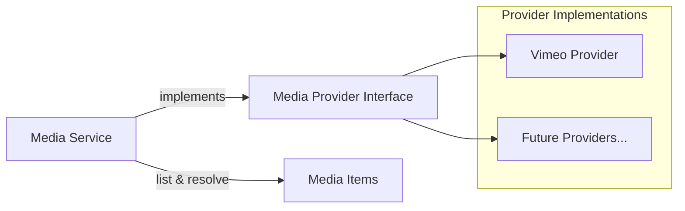
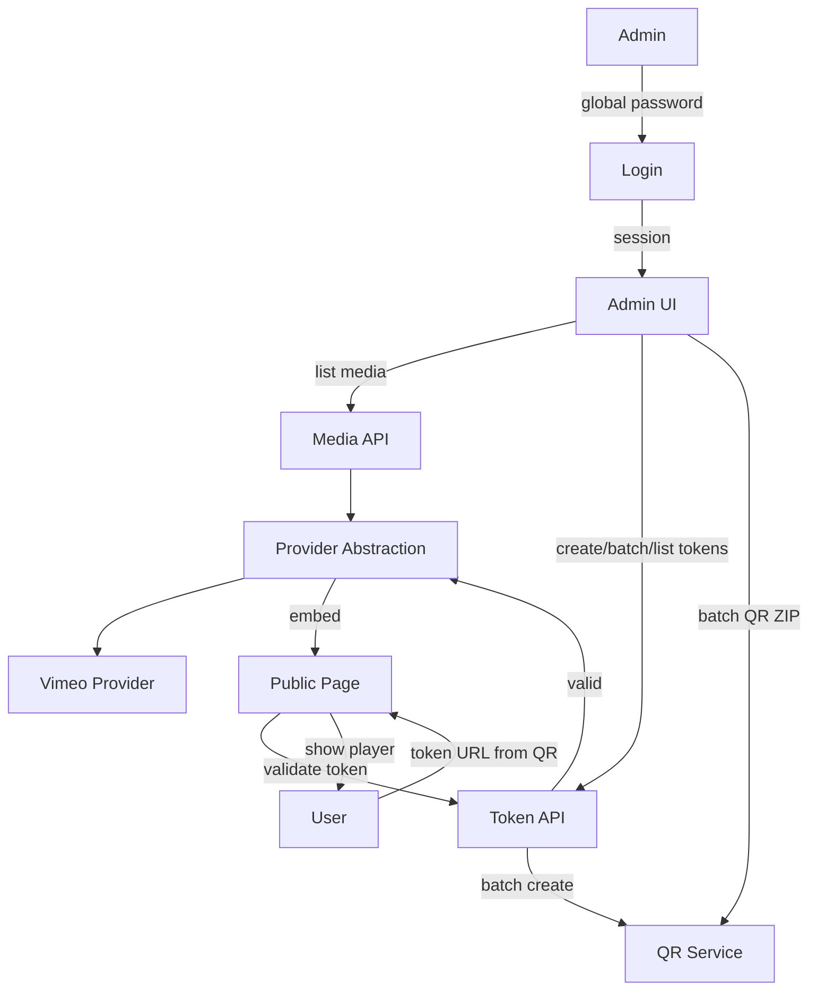

# Media Access Manager - MVP Concept

## Overview

A simplified Nuxt.js webapp for managing token-based access to media from different providers. Admins use a single global password to manage media and generate access tokens (single or batch). Batch tokens can be exported as QR codes in a ZIP for printing. End users access media via token URLs; invalid tokens show a "contact support" message. The app is white-labelable (primary color, logo, company name).

---

## Comparison: Original vs. MVP

| Aspect    | Original Concept                    | MVP                                            |
| --------- | ----------------------------------- | ---------------------------------------------- |
| Auth      | User accounts (email/password)      | Single global password                         |
| Media     | Vimeo only                          | Provider abstraction layer                     |
| Tokens    | Complex (IP, batch QR, etc.)        | Create & batch per media, list tokens          |
| Analytics | Device UUID, TokenUsage, dashboards | None (later stage)                             |
| QR        | Batch generation, ZIP download      | Batch generation, ZIP download (kept)          |
| Theming   | Not specified                       | White-label: primary color, logo, company name |

---

## 1. Media Provider Abstraction Layer

Introduce a **provider interface** so media can come from different sources (Vimeo today, others later).



**oEmbed standard** – Media providers return responses in the [oEmbed format](https://oembed.com/). Use existing libraries (e.g. `oembed-parser`, `@extractus/oembed-extractor`) to fetch, parse, and render oEmbed content.

**Interface contract** (TypeScript-style):

```ts
// oEmbed response types per https://oembed.com/
interface OEmbedBase {
  type: 'photo' | 'video' | 'link' | 'rich'
  version: string
  title?: string
  author_name?: string
  author_url?: string
  provider_name?: string
  provider_url?: string
  cache_age?: number
  thumbnail_url?: string
  thumbnail_width?: number
  thumbnail_height?: number
}

interface OEmbedVideo extends OEmbedBase {
  type: 'video'
  html: string
  width: number
  height: number
}

interface OEmbedPhoto extends OEmbedBase {
  type: 'photo'
  url: string
  width: number
  height: number
}

interface OEmbedLink extends OEmbedBase {
  type: 'link'
}

interface OEmbedRich extends OEmbedBase {
  type: 'rich'
  html: string
  width?: number
  height?: number
}

type OEmbedResponse = OEmbedVideo | OEmbedPhoto | OEmbedLink | OEmbedRich;

interface MediaProvider {
  id: string // e.g. "vimeo"
  listMedia: () => Promise<MediaItem[]>
  getViewableContent: (mediaId: string, providerConfig: unknown) => Promise<OEmbedResponse>
}

interface MediaItem {
  id: string
  title: string
  providerConfig: VimeoConfig | YoutubeConfig | FileserverConfig
}
```

- **Media table**: `id`, `provider_id`, `title`, `provider_config` (JSON), `created_at`
- **Providers**: Start with Vimeo (oEmbed API); add new providers by implementing the interface and returning oEmbed-compliant responses.
- **Non-downloadable**: Use embeds only (oEmbed `html` for video); rely on provider settings to disable downloads where possible.

---

## 2. Token Model (Simplified)

**Token lifetime** (either or both):

- **Date range**: `starts_at`, `expires_at` (nullable)
- **Max usage**: `usage_limit` (nullable), `usage_count`

**Schema** (simplified):

- `tokens`: `id`, `token` (32-char), `media_id`, `batch_id` (nullable FK), `name`, `starts_at`, `expires_at`, `usage_limit`, `usage_count`, `created_at`
- No `TokenUsage`, `TokenAnalytics` tables

**Validation logic**:

- If `starts_at` is set and now < `starts_at` → invalid
- If `expires_at` is set and now > `expires_at` → invalid
- If `usage_limit` is set and `usage_count >= usage_limit` → invalid
- If valid: increment `usage_count`, return embed; if invalid: show "Contact support" message

---

## 3. Admin: Single Global Password

- **No users table**; replace with:
  - Single password in config/env (e.g. `NUXT_ADMIN_PASSWORD`)
  - Session/cookie after successful login
- **Admin capabilities**:
  - List media (from all providers)
  - Create tokens per media (single or batch)
  - Batch token generation with QR codes (ZIP download)
  - List tokens per media
- **Removed**:
  - User CRUD
  - Analytics pages and services

---

## 4. Public Flow: View with Token

1. User visits `/{token}` (or similar).
2. Validate token (dates + usage limit).
3. If invalid → show message: "This link is no longer valid. Please contact support."
4. If valid → fetch embed via provider, increment `usage_count`, render player.
5. No device tracking, no analytics.

---

## 5. White-Label Theming

Theme config, set per deployment through `NUXT_PUBLIC_THEME_*` environment
variables. See [theming.md](./theming.md) for the full reference.

| Setting              | Description                             | Example      |
| -------------------- | --------------------------------------- | ------------ |
| `title`              | Brand name                              | `Acme Media` |
| `logo` / `logoDark`  | Logo URL or path, per color mode        | `/logo.svg`  |
| `favicon`            | Browser tab icon                        | `/icon.svg`  |
| `colors.primary`     | Brand color, or a Tailwind palette name | `#0f4c81`    |
| `colors.neutral`     | Greys for text, surfaces and borders    | `slate`      |
| `radius` / `spacing` | Roundness and density of the whole UI   | `0.5rem`     |
| `container`          | Maximum content width                   | `72rem`      |

Implementation:

- `utils/theme.ts` derives a full 11-shade Tailwind-style palette from a single
  brand color and renders the theme as CSS custom properties
- `plugins/theme.ts` injects them and sets the document title and favicon
- Logo and company name in header/nav via `layouts/default.vue`

---

## 6. Architecture



---

## 7. File Structure

```text
media-access-manager/
├── server/
│   ├── api/
│   │   ├── auth/           # login, logout (global password)
│   │   ├── media/          # list media (from providers)
│   │   ├── tokens/         # CRUD tokens, batch create, list by media
│   │   │   └── batch/      # POST batch, GET batch/:id/qr-zip
│   │   └── access/         # validate token, return embed
│   ├── services/
│   │   ├── authService.ts
│   │   ├── mediaService.ts
│   │   ├── tokenService.ts
│   │   ├── qrService.ts    # QR generation, batch ZIP
│   │   └── providers/
│   │       ├── types.ts   # MediaProvider interface
│   │       └── vimeo.ts   # Vimeo implementation
├── components/
│   ├── admin/             # AdminLayout, MediaList, TokenList, TokenForm,
│   │                      # BatchTokenGenerator, QRCodeDisplay
│   └── public/
│       └── MediaPlayer.vue # Embed + invalid token message
├── pages/
│   ├── login.vue
│   ├── index.vue          # Media list
│   ├── media/
│   │   └── [id].vue       # Media detail + tokens + batch gen
│   ├── tokens/
│   │   └── batch.vue      # Batch token generation (select media, count, QR ZIP)
│   └── [token].vue        # Public access
├── utils/theme.ts         # Brand palette + theme CSS variables
└── plugins/theme.ts       # Applies the theme from runtimeConfig
```

---

## 8. Database Schema

| Table     | Columns                                                                                                        |
| --------- | -------------------------------------------------------------------------------------------------------------- |
| `media`   | id, provider_id, title, provider_config (JSON), created_at                                                     |
| `tokens`  | id, token, media_id, batch_id (nullable FK), name, starts_at, expires_at, usage_limit, usage_count, created_at |
| `batches` | id, media_id, name, created_at                                                                                 |

---

## 9. Batch Token & QR Code Flow

- **Batch creation**: Admin selects media, sets count (e.g. 50–500), expiration/usage limits; API creates tokens in bulk.
- **Batch tracking**: `batches` table and `batch_id` FK on tokens; when creating a batch, create one batch row, then N token rows with `batch_id` set.
- **QR service**: Generate QR codes with `https://{APP_URL}/{token}`; PNG/SVG; configurable size.
- **ZIP download**: `GET /api/batches/:batchId/qr-zip` returns a ZIP of all QR images for the batch.
- **Flow**: Configure batch → POST creates tokens → Download ZIP of QR codes for printing.

---

## 10. Removed Items (from original concept)

- Users table and user management
- TokenUsage, TokenAnalytics tables
- Device UUID tracking and `useDeviceTracking`
- Analytics service, routes, pages
- IP restrictions on tokens
- Charts, analytics dashboards

---

## 11. Implementation Order

1. **Provider interface + Vimeo provider** – Define interface, implement Vimeo, seed/media list
2. **Schema + token service** – Media + tokens tables, token validation (dates + usage)
3. **Global admin auth** – Single password, simple session
4. **QR service** – QR generation (URL → PNG/SVG), batch ZIP
5. **Admin UI** – Media list, media detail, token create/list, batch generator + QR ZIP download
6. **Public access page** – Token validation, embed or "Contact support" message
7. **White-label theming** – Primary color, logo, company name via CSS vars and layout

---

## 12. Environment Variables

```env
# Admin
NUXT_ADMIN_PASSWORD=...           # Hashed or plain (bcrypt recommended)

# Media providers (Vimeo)
VIMEO_API_TOKEN=...
ENCRYPTION_KEY=...           # For Vimeo passwords

# White-label (see theming.md for the full list)
NUXT_PUBLIC_THEME_TITLE=Acme Media
NUXT_PUBLIC_THEME_LOGO=/logo.svg
NUXT_PUBLIC_THEME_COLORS_PRIMARY=#0f4c81

# App
APP_URL=https://...
DATABASE_URL=...
```

---

## Summary

The MVP keeps: media list with provider abstraction, tokens per media (single + batch) with date/usage limits, batch QR generation (ZIP download), embed-only viewing, single admin password, and white-label theming. It drops: user accounts, analytics, device tracking, and IP restrictions.
